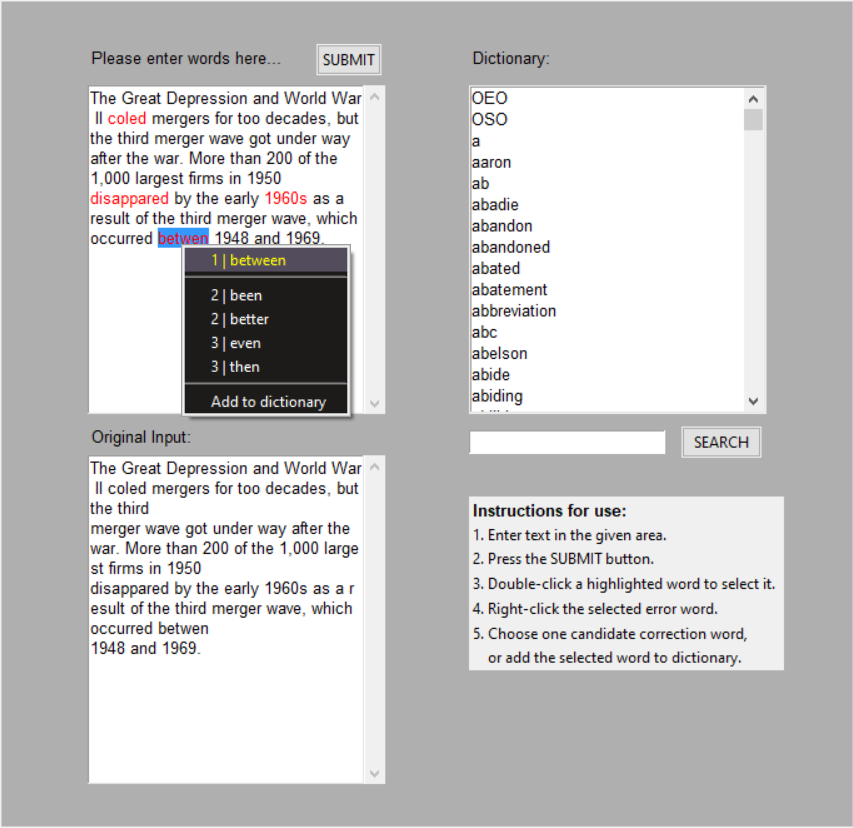
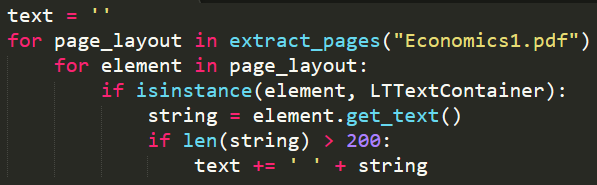
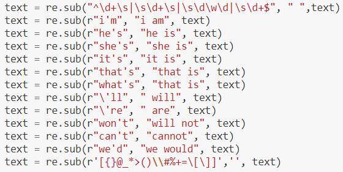
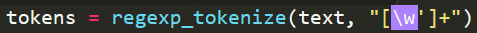
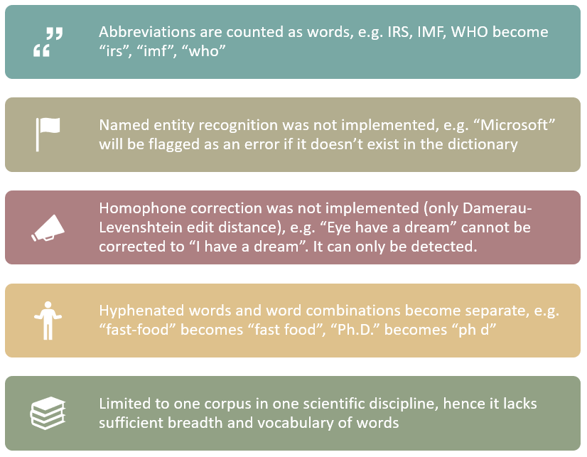

# Python Spellchecker GUI

Most Python spellcheckers require you to input your text on the command line interface
and run it to return misspelled words or suggest corrections to them. However,
we built a Python spellchecker that came with an integrated user-friendly GUI, where users 
can input their text, detect misspelled words and choose from a list of five candidate
correction words to correct them. Users can even add words to a pre-built dictionary.

An example of how this spellchecker works is shown in this [video](https://youtu.be/Xad0fN4jXpI) and the screenshot below:

**How it works:** Cut-and-paste or type your text into the provided textbox. Then click SUBMIT.
This will check for non-word errors (misspelled words that are not in the dictionary). These
errors are highlighted in red. Select the error word only, excluding the punctuation near them,
and right-click on it. Choose one correction from among 5, or add to dictionary. Then click SUBMIT
a second time, which will check for real-word errors (words that are used in bad context). These
will also be highlighted in red, and can be corrected by right-clicking on them and choosing a correction word.

## The Tasks
The team consisted of four members, including myself. I was responsible for

- Data collection
- Data extraction
- Important contributions to data cleaning and preprocessing
- Implementing backend spellchecking code and suggesting correction words
- Integrating backend code with GUI frontend written by teammate
- Adding text highlighting and right-click functionality, 
  as well as dictionary scroll-box, dictionary `SEARCH` and user instructions
  
My teammates Chibili, Farah and Jerry were responsible for

- Data cleaning and preprocessing
- Coding the Damerau-Levenshtein edit distance
- The GUI frontend: Jerry, an enthusiastic and upbeat individual, bravely took on the role of developing the frontend using Tkinter. 
He produced a fully functional GUI, which I was then able to improve upon and integrate with the backend code. He also wrote most of the final documentation for the project.
- Research: Farah found a critical research paper for detecting real-word errors. By implementing the technique proposed in the paper, I wrote code that allowed me to pinpoint the exact location of a real-word error. Previously, I could only find a phrase containing the misspelled word, not pinpoint the exact word itself.
- Resolving conflict, setting up meetings, and liasing with the instructor: Chibili, a project manager with 10+ years of experience, was the master of motivation and management. He was also responsible for formatting and making our paper aesthetically pleasing to read.
- Documenting and polishing the final paper for submission - props to Jerry and Chibili.

Although I wrote the majority of the code required for the spellchecker to function properly, 
my teammates' contributions were equally as essential for the timely and successful completion of our project.

## Data Collection
The first challenge was to find an appropriate corpus. According to the instructor, the corpus must

1. Contain at least 100,000 words
2. Be from one scientific field only
3. Have no spelling errors

Open-source corpora on the Internet are made from a combination of papers in several scientific 
and non-scientifc disciplines, popular English eBooks and the Project Gutenberg repository. 
Or the word count ranges from several million to billion words, including misspelled ones.
A thoroughly-cleaned ready-to-use corpus that is limited to only one scientific discipline, with no spelling errors and a
word count higher than 100,000 words, does not exist on the World Wide Web.

So I created my own corpus. A first-year [university economics textbook](https://sangu.ge/images/Economics1.pdf) in PDF format satisfies all the criteria. 
It contains 700 pages (excluding index and contents) and assuming 500 words per page, it should consist of
approximately 350,000 words (give or take 20,000). Being a textbook, I trusted it not to contain any spelling errors. 
Also, economics is a (social) science. 

## Data Extraction
The next challenge was to figure out how to extract text data from a PDF file.

PDFs are extremely messy objects. In addition to the main body of words, there are headers, footers, page numbers, chapter names and numbers, textboxes on the sides, images and diagrams, figure descriptions, and so on. 

Fortunately, Python has a library called [`pdfminersix`](https://pdfminersix.readthedocs.io/en/latest/tutorial/extract_pages.html), with high-level API functions that allow the user to selectively extract only the text from even the messiest of PDF files. The way `pdfminersix` achieves this is by first dividing the PDF into individual pages. For each page, there are "elements" which can be paragraphs, lines of words/letters, or figures. If the element is a `TextContainer`, i.e. it only contains words, then the text from this element is extracted.

The problem with this extraction method is that it also captures individual characters, chapter names, page numbers, headers, footers, and textboxes that detract from the main body of the text. To deal with this problem, I added a conditional clause to the code to only extract text if the `TextContainer` contains more than 200 characters. Otherwise, "C H A P T E R 1" would be extracted, which is undesirable.

## Data Preprocessing
Aside from removing the newline symbols, numbers and special characters, lowercasing all words, and dealing with extraneous spaces, an important text preprocessing step is to remove punctuation. Punctuation is not only present as commas or fullstops, but are also used in contractions, such as "what's" or "they'll" or "student's". The problem is that we want to remove punctuation but not the ones present in the contracted words. Initially, the approach was to manually collect all the common contractions and process them to divide each contraction into two words. 

However, I found a [powerful function](https://subscription.packtpub.com/book/application_development/9781782167853/1/ch01lvl1sec11/tokenizing-sentences-using-regular-expressions) in NLTK that tokenizes text based on a user-provided regular expression. This means the function will divide text into separate words, removing punctuation in the process, but not removing the apostrophe in contractions. The single line of code below completely achieves this objective compared to the snippet with many lines of non-exhaustive code shown above:

## Strengths
- Fast initialization and real-time detection of both non-word and real-word errors.
- Uses probabilistic/statistical techniques, so creator doesn't need to be a language expert.
- Makes use of context-based real-word detection technique. Uses trigram, left bigram and right bigram of each word to provide a score for it.
- Uses Stupid Back-off, so it works even if the trigram/bigrams don't exist in the corpus. This makes it very convenient and fast.

## Weaknesses

