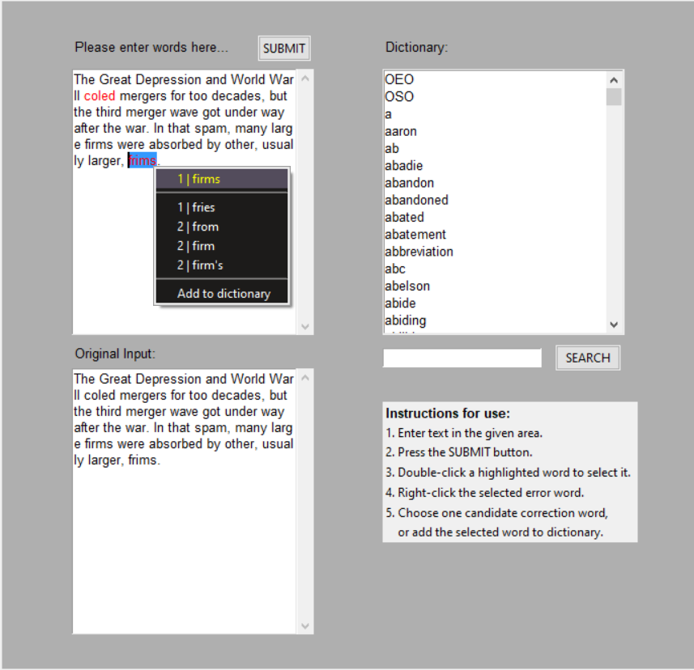

# Spell-It-Right

Most Python spellcheckers require you to input your text on the command line interface
and run it to return misspelled words or suggest corrections to them. However,
we built a Python spellchecker that came with an integrated user-friendly GUI, where users 
can input their text, detect misspelled words and choose from a list of five candidate
correction words to correct them. Users can even add words to a pre-built dictionary.

An example of how this spellchecker works is shown in this [video](https://youtu.be/Xad0fN4jXpI) and the screenshot below:

## The Team

## Data Collection

## Data Extraction

## Data Cleaning and Preprocessing

## Final Appearance of the GUI

